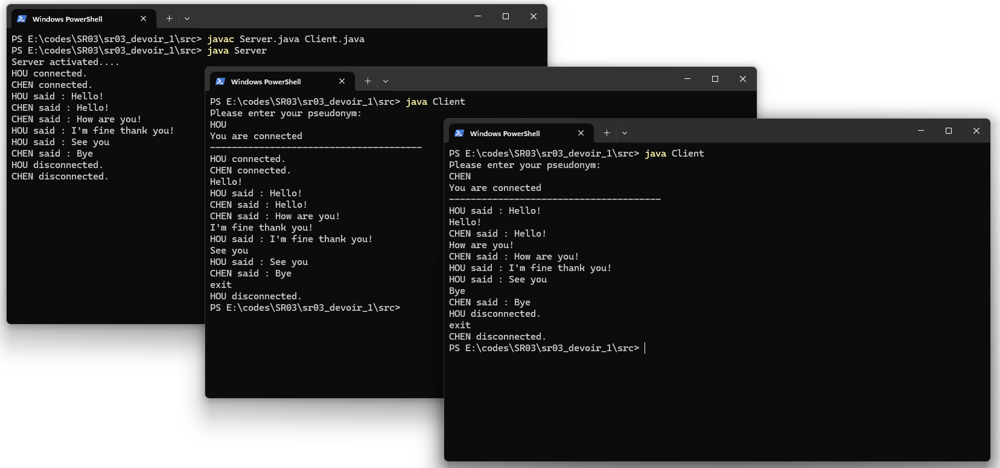
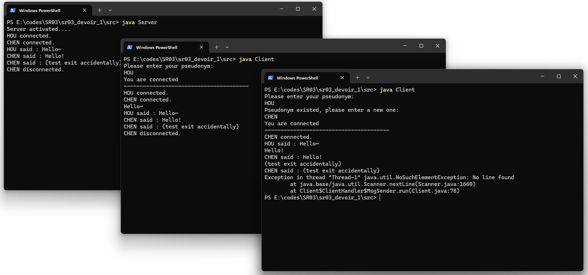

## Introduction

Le projet consiste à développer une application de chat client/serveur basée sur les sockets, permettant à un groupe de participants d'organiser des discussions publiques. Les messages échangés au sein de cette discussion sont affichés sur la console, tant du côté du client que du serveur.

## **Concept**

L'application repose sur un modèle de communication réseau client-serveur où le serveur peut gérer plusieurs connexions client simultanément. Chaque client se connecte au serveur via un socket réseau, lui permettant d'envoyer et de recevoir des messages. Les clients sont identifiés par un pseudonyme unique pour faciliter la distinction des messages.

## **Objectifs**

1. **Gestion multi-clients :** Le serveur doit être capable de gérer simultanément plusieurs clients, chacun fonctionnant dans son propre thread pour garantir une communication fluide et non bloquante.
2. **Échange de messages en temps réel :** Les clients doivent pouvoir envoyer et recevoir des messages en temps réel, avec affichage sur la console.
3. **Gestion des pseudonymes :** Avant de participer au chat, chaque client doit choisir un pseudonyme unique. Si le pseudonyme est déjà pris, le client est invité à en choisir un nouveau.

## Côté Serveur

Le serveur joue un rôle central dans l'application de chat, gérant les connexions entrantes, distribuant les messages entre les clients, et maintenant une liste des pseudonymes actifs pour éviter les doublons.

**Implémentation :**

- **Gestion des connexions :** Le serveur écoute sur un port spécifique à l'aide d'un `ServerSocket`. Pour chaque client qui se connecte, le serveur crée un nouveau `Socket` et lance un nouveau thread (`Handler`) pour gérer cette connexion.
    
    ``` java
    ServerSocket serverSocket = new ServerSocket(12001);
    while (true) {
        Socket socket = serverSocket.accept();
        Handler client = new Handler(socket);
        client.start();
    }
    ```
    
- **Gestion des messages :** Chaque thread `Handler` lit les messages entrants de son client via un `BufferedReader` et les retransmet à tous les autres clients connectés en utilisant une méthode `sendMsg` synchronisée sur la liste des clients.
    
    ``` java
    private void sendMsg(String msg) {
        for (Handler cl : clientList) {
            BufferedWriter bw = new BufferedWriter(new OutputStreamWriter(cl.client.getOutputStream()));
            bw.write(msg);
            bw.newLine();
            bw.flush();
        }
    }
    ```
    
- **Gestion des pseudonymes :** Avant d'ajouter un client à la liste des clients actifs, le serveur vérifie l'unicité du pseudonyme. Si le pseudonyme est déjà utilisé, le serveur demande au client d'en choisir un nouveau.

**Choix des structures de données :**

- **`CopyOnWriteArrayList` pour `clientList` :** Cette structure de données est utilisée pour stocker les objets `Handler` représentant les clients connectés. Elle est thread-safe, ce qui signifie qu'elle est conçue pour être sûre dans un contexte où plusieurs threads tentent de la modifier simultanément. Lorsqu'un thread modifie la liste (par exemple, en ajoutant ou en supprimant un client), une nouvelle copie de la liste est créée, ce qui évite les problèmes de concurrence. Ce choix est pertinent car dans une application chat, les clients peuvent se connecter et se déconnecter fréquemment, nécessitant des modifications récurrentes de la liste.
    
    ``` java
    private static List<Handler> clientList = new CopyOnWriteArrayList<>();
    ```
    

**Méthodes et surcharges :**

- **Méthode `sendMsg` pour la distribution des messages :** Cette méthode illustre le choix de conception pour envoyer des messages à tous les clients connectés. Elle itère sur la liste des clients et utilise un `BufferedWriter` pour envoyer le message. Le choix d'utiliser un `BufferedWriter` plutôt qu'un autre type de flux d'écriture est dû à sa capacité à mettre en tampon les caractères, permettant ainsi une écriture plus efficace des données sur le réseau.
    
    ``` java
    private void sendMsg(String msg) {
        for (Handler cl : clientList) {
            try {
                BufferedWriter bw = new BufferedWriter(new OutputStreamWriter(cl.client.getOutputStream()));
                bw.write(msg);
                bw.newLine();
                bw.flush();
            } catch (IOException e) {
                clientList.remove(cl);
                pseudoList.remove(cl.pseudonym);
            }
        }
    }
    ```
    

## Côté Client

Le client est responsable de la connexion au serveur, de l'envoi de messages, et de l'affichage des messages reçus de la part d'autres clients.

**Implémentation :**

- **Connexion au serveur :** Le client se connecte au serveur en spécifiant l'adresse IP du serveur et le port d'écoute à l'aide d'un objet `Socket`.
    
    ``` java
    Socket socket = new Socket("localhost", 12001);
    ```
    
- **Envoi de messages :** Un thread `MsgSender` lit l'entrée de l'utilisateur depuis la console et envoie les messages au serveur via un `BufferedWriter`.
    
    ``` java
    String msg = sc.nextLine();
    bw.write(msg);
    bw.newLine();
    bw.flush();
    ```
    
- **Réception de messages :** Un autre thread `MsgReceiver` écoute les messages venant du serveur et les affiche sur la console du client.
    
    ``` java
    String msg;
    while ((msg = br.readLine()) != null) {
        System.out.println(msg);
    }
    ```
    
- **Gestion des pseudonymes :** À la connexion, le client envoie un pseudonyme au serveur et attend une réponse pour savoir si le pseudonyme est accepté ou non.

**Architecture multithread :**

- **Séparation des responsabilités entre `MsgSender` et `MsgReceiver` :** L'architecture du client repose sur deux classes internes distinctes, `MsgSender` et `MsgReceiver`, chacune étant un thread qui gère respectivement l'envoi de messages au serveur et la réception de messages du serveur. Cette séparation permet une interaction simultanée et fluide avec le serveur, où l'utilisateur peut envoyer des messages tout en recevant des réponses sans blocage. Cela améliore l'expérience utilisateur en rendant la communication chat plus interactive et réactive.

**Utilisation des flux d'entrée/sortie :**

- **BufferedReader et BufferedWriter :** Pour lire les messages du serveur et envoyer des messages au serveur, le client utilise `BufferedReader` et `BufferedWriter`. Ces choix sont dus à leur efficacité en termes de performances par rapport à la lecture et à l'écriture brute de flux d'entrée/sortie. En effet, la mise en tampon permet de réduire le nombre d'opérations d'entrée/sortie, ce qui est crucial dans un contexte réseau où ces opérations peuvent être coûteuses en termes de temps et de ressources.
    
    ``` java
    BufferedWriter bw = new BufferedWriter(new OutputStreamWriter(socket.getOutputStream()));
    BufferedReader br = new BufferedReader(new InputStreamReader(socket.getInputStream()));
    ```
    

## Perspectives d'amélioration

1. Sécurité des communications : L'ajout de mécanismes de sécurité, tels que le chiffrement des messages et l'authentification des clients, pourrait renforcer la confidentialité et l'intégrité des données échangées.
2. Interface utilisateur graphique : Pour améliorer l'expérience utilisateur, l'introduction d'une interface utilisateur graphique (GUI) pourrait rendre l'application plus accessible et conviviale, en remplaçant la console par une interface plus riche.

## Démarrage du programme

**1. Pour récupérer le programme**
``` 
cd existing_repo
git clone https://gitlab.utc.fr/sr03_group/sr03_devoir_1.git
cd sr03_devoir_1
```

**2. Pour lancer le serveur**
```
cd src
javac Serveur.java Client.java
java Serveur
```

**3. Pour lancer les clients**, vous pouvez ouvrir plusieur terminal et effectuer les même opérations
```
cd src
java Client
```

## Exemples de test

**Chat normal**


**Test sur des problèmes**

## Résolution des problèmes

### Comment garantir l'unicité des pseudonymes ?

Pour assurer l'unicité des pseudonymes, le serveur maintient une liste (`pseudoList`) des pseudonymes déjà utilisés par les clients connectés. Lorsqu'un nouveau client tente de se connecter, le serveur vérifie si le pseudonyme soumis existe déjà dans cette liste. Si le pseudonyme est déjà pris, le serveur informe le client que le pseudonyme est invalide, et le client doit en soumettre un nouveau.

**Implémentation de la solution :**

Dans la classe `Server.Handler`, lors de l'établissement de la connexion, avant d'ajouter le client à la liste des clients actifs (`clientList`) et la liste des pseudonymes (`pseudoList`), le serveur lit le pseudonyme envoyé par le client et vérifie son unicité :

``` java
do {
    pseudonym = br.readLine();
    String msg = pseudoList.contains(pseudonym) ? "Invalid" : "Valid";
    bw.write(msg);
    bw.newLine();
    bw.flush();
} while (pseudoList.contains(pseudonym));
```

Si le pseudonyme est unique, le serveur l'ajoute à `pseudoList` et continue le processus de connexion. Si le pseudonyme est déjà pris, le serveur envoie un message "Invalid" au client, lui demandant de choisir un autre pseudonyme. Ce processus se répète jusqu'à ce qu'un pseudonyme valide soit fourni.

### Que faire en cas de déconnexion inattendue du client ou du serveur ?

En cas de déconnexion inattendue du client (par exemple, si le client ferme l'application sans envoyer de commande de "sortie" appropriée), le serveur peut ne pas être informé immédiatement de la déconnexion. Pour gérer cela, il est nécessaire d'implémenter une logique de détection de déconnexion dans le serveur. L'une des méthodes pour détecter une déconnexion est de surveiller les exceptions `IOException` lors des tentatives de lecture ou d'écriture sur le flux du client. Si une exception est attrapée, cela indique probablement que le client s'est déconnecté inopinément.

**Implémentation de la solution :**

Dans la classe `Server.Handler`, la gestion des exceptions `IOException` peut être utilisée pour détecter une déconnexion inattendue :

``` java
try {
    // Logique de communication avec le client
} catch (IOException e) {
    // Le client s'est probablement déconnecté inopinément
} finally {
    // Nettoyage de la connexion client
    System.out.println(pseudonym + " disconnected.");
    sendMsg(pseudonym + " disconnected.");
    clientList.remove(this);
    pseudoList.remove(pseudonym);
    try {
        client.close();
    } catch (IOException e) {
        System.err.println("Error closing connection with " + pseudonym + ": " + e.getMessage());
    }
}
```

Dans ce bloc `finally`, le serveur effectue le nettoyage nécessaire, tel que l'annonce de la déconnexion du client aux autres clients, la suppression du pseudonyme de la liste des pseudonymes actifs, et la fermeture de la socket client. Cette approche garantit que même en cas de déconnexion inattendue, les ressources sont libérées correctement et l'état du serveur reste cohérent.